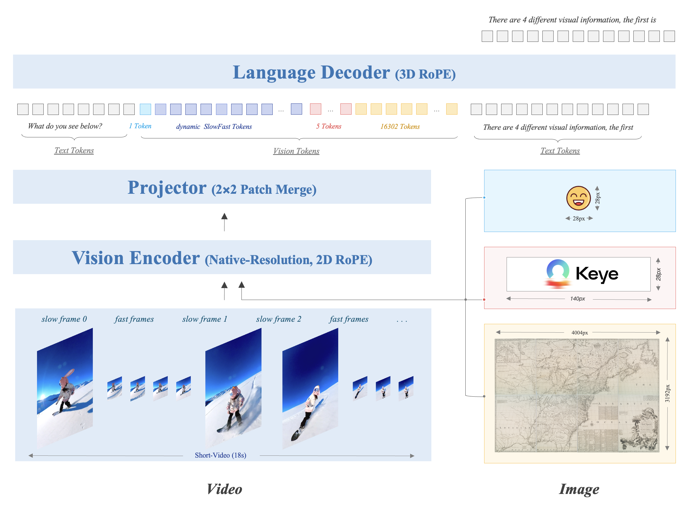

```bash
pip install keye-vl-utils==1.5.2 
pip install huggingface_hub transformers torch torchvision -U
pip install "numpy<2" opencv-python
pip install flash-attn --no-build-isolation
pip install moviepy==1.0.3
```

```python
import os
import re
import shutil

def extract_boxed_content(text):
    """
    使用正则表达式提取 \boxed{ 和 } 之间的内容。
    """
    pattern = r'\\boxed{(.*?)}</answer>'
    match = re.search(pattern, text, re.DOTALL)
    if match:
        return match.group(1).strip()
    return None

def process_files(input_dir, output_dir):
    """
    处理输入文件夹中的文件对。
    """
    # 确保输出目录存在
    os.makedirs(output_dir, exist_ok=True)
    
    # 获取所有文件列表
    all_files = os.listdir(input_dir)
    
    # 找出所有媒体文件 (.mp4, .png) 和文本文件 (.txt)
    media_files = [f for f in all_files if f.endswith(('.mp4', '.png'))]
    txt_files = [f for f in all_files if f.endswith('.txt')]
    
    # 创建文本文件的基名映射，方便查找对应媒体文件
    txt_base_to_file = {os.path.splitext(f)[0]: f for f in txt_files}
    
    processed_count = 0
    skipped_count = 0
    
    for media_file in media_files:
        base_name = os.path.splitext(media_file)[0]
        corresponding_txt = txt_base_to_file.get(base_name)
        
        if corresponding_txt is None:
            print(f"警告: 媒体文件 {media_file} 没有对应的文本文件，跳过。")
            skipped_count += 1
            continue
        
        txt_path = os.path.join(input_dir, corresponding_txt)
        
        try:
            with open(txt_path, 'r', encoding='utf-8') as f:
                content = f.read()
        except Exception as e:
            print(f"读取文件 {txt_path} 时出错: {e}，跳过。")
            skipped_count += 1
            continue
        
        extracted_content = extract_boxed_content(content)
        
        if extracted_content is None or extracted_content == "":
            print(f"从 {corresponding_txt} 中未提取到内容，跳过 {media_file}。")
            skipped_count += 1
            continue
        
        # 拷贝媒体文件
        media_src = os.path.join(input_dir, media_file)
        media_dst = os.path.join(output_dir, media_file)
        try:
            shutil.copy2(media_src, media_dst)
        except Exception as e:
            print(f"拷贝媒体文件 {media_file} 时出错: {e}，跳过。")
            skipped_count += 1
            continue
        
        # 保存提取的字符串到文本文件
        output_txt_filename = base_name + ".txt"
        output_txt_path = os.path.join(output_dir, output_txt_filename)
        try:
            with open(output_txt_path, 'w', encoding='utf-8') as f:
                f.write(extracted_content)
        except Exception as e:
            print(f"写入提取内容到 {output_txt_path} 时出错: {e}")
            # 如果写入失败，尝试删除已拷贝的媒体文件以保持一致性？
            try:
                os.remove(media_dst)
            except:
                pass
            skipped_count += 1
            continue
        
        print(f"成功处理: {media_file} 和 {corresponding_txt}")
        processed_count += 1
    
    print(f"处理完成。成功处理 {processed_count} 对文件，跳过 {skipped_count} 对文件。")

if __name__ == "__main__":
    input_directory = "Prince_Ciel_Phantomhive_Sebastian_Michaelis_both_Videos_keye_captioned"  # 请修改为您的输入文件夹路径
    output_directory = "Prince_Ciel_Phantomhive_Sebastian_Michaelis_both_Videos_keye_extract_captioned" # 请修改为您的输出文件夹路径
    
    process_files(input_directory, output_directory)
    
```

# Kwai Keye-VL


<div align="center">
  
</div>

<font size=7><div align='center' >  
[[🍎 Home Page](https://kwai-keye.github.io/)] 
[[📖 Technique Report](https://arxiv.org/abs/2509.01563)] 
[[📊 Keye-VL-8B-Preview](https://huggingface.co/Kwai-Keye/Keye-VL-8B-Preview) ]
[[📊 Keye-VL-1.5-8B](https://huggingface.co/Kwai-Keye/Keye-VL-1.5-8B/) ]
[[🚀 Demo](https://huggingface.co/spaces/Kwai-Keye/Keye-VL-8B-Preview)]
</div></font>

## 🔥 News


* **`2025.09.01`** 🌟 **Kwai Keye-VL 1.5 Technical Report** is now available at [arxiv](https://arxiv.org/abs/2509.01563).  
* **`2025.08.28`** 🌟 We are excited to introduce **Kwai Keye-VL-1.5**, a more powerful version! By incorporating innovative `Slow-Fast Video Encoding strategy`, `new LongCoT Cold-Start data pipeline`, and `advanced RL training strategies`, Keye-VL-1.5 reaches new heights in video understanding, image comprehension, and reasoning capabilities. Plus, it now supports an extended context length of up to **128k** tokens for handling longer conversations and complex tasks. Stay tuned for more groundbreaking innovations! 
* **`2025.07.08`** 🌟 Keye-VL is supported by [swift](https://github.com/modelscope/ms-swift) and [vLLM](https://github.com/vllm-project/vllm). Feel free to use it without hesitation!
* **`2025.07.01`** 🌟 We are excited to announce the release of our comprehensive technical report!  You can read it now at [arxiv](https://arxiv.org/abs/2507.01949).  
* **`2025.06.26`** 🌟 We are very proud to launch **Kwai Keye-VL**, a cutting-edge multimodal large language model meticulously crafted by the **Kwai Keye Team** at [Kuaishou](https://www.kuaishou.com/). As a cornerstone AI product within Kuaishou's advanced technology ecosystem, Keye excels in video understanding, visual perception, and reasoning tasks, setting new benchmarks in performance. Our team is working tirelessly to push the boundaries of what's possible, so stay tuned for more exciting updates!


<div align="center">
  
</div>

## Contents <!-- omit in toc -->

- [🔥 News](#-news)
- [📐 Quick Start](#-quick-start)
  - [Preprocess and Inference](#preprocess-and-inference)
  - [Evaluation](#evaluation)
- [👀 Architecture and Training Strategy](#-architecture-and-training-strategy)
  - [🌟 Pre-Train](#-pre-train)
  - [🌟 Post-Train](#-post-train)
- [📈 Experimental Results](#-experimental-results)
- [✒️ Citation](#️-citation)

## 📐 Quick Start
### Preprocess and Inference

See [keye-vl-utils/README.md](keye-vl-utils/README.md) for details. ```Keye-vl-utils``` contains a set of helper functions for processing and integrating visual language information with Keye Series Model.

#### Install

```bash
pip install keye-vl-utils
```

#### Keye-VL-1.5 Inference

```python
from transformers import AutoModel, AutoTokenizer, AutoProcessor
from keye_vl_utils import process_vision_info

# default: Load the model on the available device(s)
model_path = "Kwai-Keye/Keye-VL-1.5-8B"

model = AutoModel.from_pretrained(
    model_path,
    torch_dtype="auto",
    device_map="auto",
    trust_remote_code=True,
)

# We recommend enabling flash_attention_2 for better acceleration and memory saving, especially in multi-image and video scenarios.
# model = KeyeForConditionalGeneration.from_pretrained(
#     "Kwai-Keye/Keye-VL-8B-Preview",
#     torch_dtype=torch.bfloat16,
#     attn_implementation="flash_attention_2",
#     device_map="auto",
# )

# default processer
processor = AutoProcessor.from_pretrained(model_path, trust_remote_code=True)

# The default range for the number of visual tokens per image in the model is 4-16384.
# You can set min_pixels and max_pixels according to your needs, such as a token range of 256-1280, to balance performance and cost.
# min_pixels = 256*28*28
# max_pixels = 1280*28*28
# processor = AutoProcessor.from_pretrained(model_pat, min_pixels=min_pixels, max_pixels=max_pixels, trust_remote_code=True)

# Non-Thinking Mode
messages = [
    {
        "role": "user",
        "content": [
            {
                "type": "image",
                "image": "https://s1-11508.kwimgs.com/kos/nlav11508/mllm_all/ziran_jiafeimao_11.jpg",
            },
            {"type": "text", "text": "Describe this image./no_think"},
        ],
    }
]

# Auto-Thinking Mode
messages = [
    {
        "role": "user",
        "content": [
            {
                "type": "image",
                "image": "https://s1-11508.kwimgs.com/kos/nlav11508/mllm_all/ziran_jiafeimao_11.jpg",
            },
            {"type": "text", "text": "Describe this image."},
        ],
    }
]

# Thinking mode
messages = [
    {
        "role": "user",
        "content": [
            {
                "type": "image",
                "image": "https://s1-11508.kwimgs.com/kos/nlav11508/mllm_all/ziran_jiafeimao_11.jpg",
            },
            {"type": "text", "text": "Describe this image./think"},
        ],
    }
]
# video inputs
messages = [
    {
        "role": "user",
        "content": [
            {
                "type": "video",
                "video": "http://s2-11508.kwimgs.com/kos/nlav11508/MLLM/videos_caption/98312843263.mp4",
            },
            {"type": "text", "text": "Describe this video."},
        ],
    }
]

# Preparation for inference
text = processor.apply_chat_template(
    messages, tokenize=False, add_generation_prompt=True
)
image_inputs, video_inputs, mm_processor_kwargs = process_vision_info(messages)
inputs = processor(
    text=[text],
    images=image_inputs,
    videos=video_inputs,
    padding=True,
    return_tensors="pt",
    **mm_processor_kwargs
)
inputs = inputs.to("cuda")

# Inference: Generation of the output
generated_ids = model.generate(**inputs, max_new_tokens=1024)
generated_ids_trimmed = [
    out_ids[len(in_ids) :] for in_ids, out_ids in zip(inputs.input_ids, generated_ids)
]
output_text = processor.batch_decode(
    generated_ids_trimmed, skip_special_tokens=True, clean_up_tokenization_spaces=False
)
print(output_text)
```

#### Deployment
- We recommend using vLLM for fast deployment and inference.

##### Install
```bash
pip install keye-vl-utils "vllm>=0.9.2"
```

##### Offline Inference
```bash
# refer to https://github.com/QwenLM/Qwen2.5-VL?tab=readme-ov-file#inference-locally

from transformers import AutoProcessor
from vllm import LLM, SamplingParams
from keye_vl_utils import process_vision_info

model_path = "/hetu_group/jky/playground_hhd_2/2025/20250626_keye/Keye-VL-8B-Preview"

llm = LLM(
    model=model_path,
    limit_mm_per_prompt={"image": 10, "video": 10},
    trust_remote_code=True,
)

sampling_params = SamplingParams(
    temperature=0.3,
    max_tokens=256,
)

# image
image_messages = [
    {
        "role": "user",
        "content": [
            {
                "type": "image",
                "image": "https://s1-11508.kwimgs.com/kos/nlav11508/mllm_all/ziran_jiafeimao_11.jpg",
            },
            {"type": "text", "text": "Describe this image./think"},
        ],
    },
]

# video
video_messages = [
    {
        "role": "user",
        "content": [
            {
                "type": "video",
                "video": "http://s2-11508.kwimgs.com/kos/nlav11508/MLLM/videos_caption/98312843263.mp4",
            },
            {"type": "text", "text": "Describe this video./think"},
        ],
    },
]

# Here we use video messages as a demonstration
messages = video_messages

processor = AutoProcessor.from_pretrained(model_path, trust_remote_code=True)
prompt = processor.apply_chat_template(
    messages,
    tokenize=False,
    add_generation_prompt=True,
)
image_inputs, video_inputs, video_kwargs = process_vision_info(
    messages, return_video_kwargs=True
)

mm_data = {}
if image_inputs is not None:
    mm_data["image"] = image_inputs
if video_inputs is not None:
    mm_data["video"] = video_inputs

llm_inputs = {
    "prompt": prompt,
    "multi_modal_data": mm_data,
    # FPS will be returned in video_kwargs
    "mm_processor_kwargs": video_kwargs,
}

outputs = llm.generate([llm_inputs], sampling_params=sampling_params)
generated_text = outputs[0].outputs[0].text

print(generated_text)
```

##### Online Serving
- Serve
```bash
vllm serve \
    Kwai-Keye/Keye-VL-8B-Preview \
    --tensor-parallel-size 8 \
    --enable-prefix-caching \
    --gpu-memory-utilization 0.8 \
    --host 0.0.0.0 \
    --port 8000 \
    --trust-remote-code
```

- Openai Chat Completion Client
```python
import base64
import numpy as np
from PIL import Image
from io import BytesIO
from openai import OpenAI
from keye_vl_utils import process_vision_info
import requests


# Set OpenAI's API key and API base to use vLLM's API server.
openai_api_key = "EMPTY"
openai_api_base = "http://localhost:8000/v1"

client = OpenAI(
    api_key=openai_api_key,
    base_url=openai_api_base,
)

# image url
image_messages = [
    {
        "role": "user",
        "content": [
            {
                "type": "image_url",
                "image_url": {
                    "url": "https://s1-11508.kwimgs.com/kos/nlav11508/mllm_all/ziran_jiafeimao_11.jpg"
                },
            },
            {"type": "text", "text": "Describe this image./think"},
        ],
    },
]

chat_response = client.chat.completions.create(
    model="Kwai-Keye/Keye-VL-8B-Preview",
    messages=image_messages,
)
print("Chat response:", chat_response)

# image base64-encoded

import base64

image_path = "/path/to/local/image.png"
with open(image_path, "rb") as f:
    encoded_image = base64.b64encode(f.read())
encoded_image_text = encoded_image.decode("utf-8")
image_messages = [
    {
        "role": "user",
        "content": [
            {
                "type": "image_url",
                "image_url": {
                    "url": f"data:image;base64,{encoded_image_text}"
                },
            },
            {"type": "text", "text": "Describe this image./think"},
        ],
    },
]

chat_response = client.chat.completions.create(
    model="Kwai-Keye/Keye-VL-8B-Preview",
    messages=image_messages,
)
print("Chat response:", chat_response)

# video, refer to https://github.com/QwenLM/Qwen2.5-VL?tab=readme-ov-file#start-an-openai-api-service
video_messages = [
    {"role": "user", "content": [
        {"type": "video", "video": "http://s2-11508.kwimgs.com/kos/nlav11508/MLLM/videos_caption/98312843263.mp4"},
        {"type": "text", "text": "Describe this video./think"}]
    },
]

def prepare_message_for_vllm(content_messages):
    vllm_messages, fps_list = [], []
    for message in content_messages:
        message_content_list = message["content"]
        if not isinstance(message_content_list, list):
            vllm_messages.append(message)
            continue

        new_content_list = []
        for part_message in message_content_list:
            if 'video' in part_message:
                video_message = [{'content': [part_message]}]
                image_inputs, video_inputs, video_kwargs = process_vision_info(video_message, return_video_kwargs=True)
                assert video_inputs is not None, "video_inputs should not be None"
                video_input = (video_inputs.pop()).permute(0, 2, 3, 1).numpy().astype(np.uint8)
                fps_list.extend(video_kwargs.get('fps', []))

                # encode image with base64
                base64_frames = []
                for frame in video_input:
                    img = Image.fromarray(frame)
                    output_buffer = BytesIO()
                    img.save(output_buffer, format="jpeg")
                    byte_data = output_buffer.getvalue()
                    base64_str = base64.b64encode(byte_data).decode("utf-8")
                    base64_frames.append(base64_str)

                part_message = {
                    "type": "video_url",
                    "video_url": {"url": f"data:video/jpeg;base64,{','.join(base64_frames)}"}
                }
            new_content_list.append(part_message)
        message["content"] = new_content_list
        vllm_messages.append(message)
    return vllm_messages, {'fps': fps_list}


video_messages, video_kwargs = prepare_message_for_vllm(video_messages)


chat_response = client.chat.completions.create(
    model="Kwai-Keye/Keye-VL-8B-Preview",
    messages=video_messages,
    max_tokens=128,
    extra_body={
        "mm_processor_kwargs": video_kwargs
    }
)

print("Chat response:", chat_response)
```

### Evaluation
See [evaluation/KC-MMBench/README.md](evaluation/KC-MMBench/README.md) for details.

## 👀 Architecture and Training Strategy

<div align="center">
  
  <i> The Kwai Keye-VL-1.5 model architecture is based on the Qwen3-8B language model and incorporates a vision encoder initialized from the open-source SigLIP. It supports SlowFast video encoding and native dynamic resolution, preserving the original aspect ratio of images by dividing each into a 14x14 patch sequence. A simple MLP layer then maps and merges the visual tokens. The model uses 3D RoPE for unified processing of text, image, and video information.</i>
</div>


### 🌟 Pre-Train


<div align="center">
  
  <i> A SlowFast video (generated by Kling) encoding demonstration: the Slow processes a smaller number of frames at higher resolution, while the Fast handles more frames at lower resolution.</i>
</div>


### 🌟 Post-Train


<div align="center">
  
  <br>
  <i>The post-training process includes non-reasoning stage and reasoning stage. The non-reasoning stage is composed of SFT and MPO training. The reasoning stage consists of three key steps: CoT Cold Start (we construct a five-step construction pipeline to generate high-quality CoT Cold-Start Dataset and apply model merging to refine model performance), General RL (we concentrate on improving Keye-VL-1.5's reasoning ability, applying GSPO, we propose progressive hint sampling to fully take advantage of hard problems and iteratively improve the cold-start and general RL model), and Alignment RL (improving Keye-VL-1.5's instruction following, format adherence, preference alignment and RAG ability with our reward system, we construct instruction following data, reasoning data and RAG data for RL training in this step).</i>
</div>


## 📈 Experimental Results

<div align="center">
  
</div>

1. Keye-VL-1.5-8B establishes itself with powerful, state-of-the-art perceptual abilities that are competitive with leading models. 
2. Keye-VL-1.5-8B demonstrates exceptional proficiency in video understanding. Across a comprehensive suite of authoritative public video benchmarks, including Video-MME, Video-MMMU, TempCompass, LongVideoBench, and MMVU, the model's performance significantly surpasses that of other top-tier models of a comparable size.
3. In evaluation sets that require complex logical reasoning and mathematical problem-solving, such as WeMath, MathVerse, and LogicVista, Kwai Keye-VL-1.5-8B displays a strong performance curve. This highlights its advanced capacity for logical deduction and solving complex quantitative problems.


## ✒️ Citation

If you find our work helpful for your research, please consider citing our work.   

```bibtex
@misc{kwaikeyeteam2025kwaikeyevl15technical,
      title={Kwai Keye-VL 1.5 Technical Report}, 
      author={Kwai Keye Team},
      year={2025},
      eprint={2509.01563},
      archivePrefix={arXiv},
      primaryClass={cs.CV},
      url={https://arxiv.org/abs/2509.01563}, 
}
@misc{kwaikeyeteam2025kwaikeyevltechnicalreport,
      title={Kwai Keye-VL Technical Report}, 
      author={Kwai Keye Team},
      year={2025},
      eprint={2507.01949},
      archivePrefix={arXiv},
      primaryClass={cs.CV},
      url={https://arxiv.org/abs/2507.01949}, 
}
```

## Acknowledgement

Kwai Keye-VL is developed based on the codebases of the following projects: [SigLIP](https://huggingface.co/google/siglip-so400m-patch14-384), [Qwen3](https://github.com/QwenLM/Qwen3), [Qwen2.5-VL](https://github.com/QwenLM/Qwen2.5-VL), [VLMEvalKit](https://github.com/open-compass/VLMEvalKit). We sincerely thank these projects for their outstanding work.
